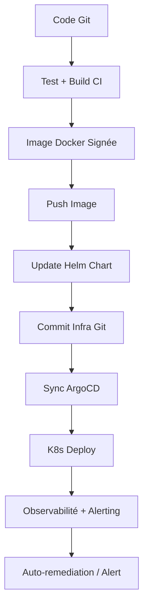

# 🧭 **GUIDE COMPLET : Migration d’un Système Legacy Critique vers le Cloud — sans Interruption**

## 🎯 Objectif global

> Migrer **15 ans de données critiques**, **47 applications interconnectées**, avec **3 millions de transactions/jour**, sans **aucune interruption de service**, dans un contexte contraint :

* 💾 Infrastructure obsolète (2008)
* 📉 Aucune documentation complète
* 💰 Budget limité à 2,8 M€

---

## 🧱 ÉTAPE 1 : Diagnostic stratégique & cartographie initiale

### 🎯 Objectif

Comprendre **l'existant dans sa globalité**, identifier les dépendances et risques majeurs avant d'amorcer la migration.

---

### 📋 Plan d'action détaillé

| Action                                  | Description                                                                                        |
| --------------------------------------- | -------------------------------------------------------------------------------------------------- |
| 🗃️ Collecte des artefacts              | Centraliser code source, scripts, logs, schémas de BDD, configurations, fichiers batch             |
| 🗺️ Cartographie applicative            | Identifier les flux inter-applications (API, batchs, triggers), SLA, types de données échangées    |
| 🔍 Analyse de la criticité & complexité | Identifier SPOFs, couplages forts, composants obsolètes ou à risque (ex : versions non maintenues) |
| 📊 Analyse de la performance            | Benchmark CPU, I/O, latence, bande passante, volumétrie en base et fréquence d’usage               |
| 📄 Analyse de conformité & sécurité     | Vérifier RGPD, accès critiques, droits utilisateurs, audit trail                                   |

---

### 📊 Outils recommandés

| Catégorie     | Outils                                                      |
| ------------- | ----------------------------------------------------------- |
| Supervision   | Elastic Stack (Elasticsearch, Logstash, Kibana), Prometheus |
| Documentation | Confluence, Notion, GitLab Wikis                            |
| Cartographie  | Miro, Draw\.io, ArchiMate                                   |
| Collaboration | Jira, Trello, Notion                                        |

---

### ✅ Bonnes pratiques

* Créer une **fiche standardisée par application** incluant :

  * Rôle métier
  * Stack technologique
  * Données manipulées
  * Fréquence d’usage
  * Criticité (SLA, SLO, SLI)
  * Points de couplage
* Classer les applications selon leur **criticité business**
* Identifier les applications **orphelines** ou à **forte dette technique**
* Produire un **graph de dépendance inter-applicative**
* Valider la **conformité RGPD** sur chaque domaine fonctionnel

---

### 📌 Exemple de fiche applicative

| Élément              | Valeur                                |
| -------------------- | ------------------------------------- |
| Nom de l’application | BillingCore                           |
| Stack technique      | Java 6, Oracle 11g, WebLogic          |
| Propriétaire         | DSI - Division Finance                |
| Données critiques    | Facturation, taxes, historique client |
| Interfaces           | CRM, ERP, Paiement                    |
| Dépendances          | DB commune, batch nocturne            |
| Fréquence            | Temps réel + batchs                   |
| Documentation        | Partielle (dernier update : 2016)     |

---

## 🏗️ ÉTAPE 2 : Construction d’une Architecture Parallèle (Miroir)

### 🎯 Objectif

Créer un **environnement cloud complet** en miroir du legacy, capable de :

* Exécuter les mêmes traitements
* Traiter les mêmes flux en parallèle
* Réagir en cas de bascule sans impacter la production

---

### 📐 Architecture cible (hybride cloud + event-driven)

#### 🧱 Architecture technique simplifiée


| Composant           | Rôle                                                    |
| ------------------- | ------------------------------------------------------- |
| 🖥️ Legacy          | Source de vérité (lecture seule)                        |
| ☁️ Cloud Mirror     | Nouvelle architecture K8s + services managés (RDS, S3…) |
| 🔄 Kafka + Debezium | Capture et stream des données (CDC)                     |
| ⚙️ Terraform        | Provisionnement infra cloud, IaC                        |
| 🧭 Istio            | Service Mesh pour routage progressif                    |
| 💾 Velero           | Sauvegarde/restauration (bases, PV, configs)            |
| 📈 Elastic Stack    | Supervision centralisée des deux environnements         |

---

### 🛠️ Outils utilisés

| Fonction             | Outils/Méthodes utilisés   |
| -------------------- | -------------------------- |
| Infra as Code        | Terraform + Ansible        |
| Cluster containerisé | Kubernetes (K8s), Helm     |
| Observabilité        | ELK + Prometheus + Grafana |
| CI/CD                | GitLab CI, ArgoCD          |
| Sauvegardes          | Velero + snapshots S3      |
| Sécurité + Routage   | Istio, cert-manager, OPA   |

---

### 📊 Dimensionnement recommandé

| Ressource      | Spécification initiale (scalable)        |
| -------------- | ---------------------------------------- |
| Noeuds K8s     | 6 nœuds (3 front, 3 back, autoscaling)   |
| Brokers Kafka  | 3 brokers, replication factor 2          |
| Stockage objet | 8 To (S3) + versioning                   |
| DB cloud (RDS) | PostgreSQL multi-AZ + 1 read-replica     |
| Monitoring     | 1 cluster Elastic, 1 Prometheus          |
| Sauvegarde     | Snapshots S3 / Glacier (2 fois par jour) |

---

### ✅ Bonnes pratiques

* **Ne jamais modifier** les systèmes legacy existants
* Créer un **environnement cloud isolé** (réseau, IAM, DNS, logs)
* Activer un **double run** pour validation sur production
* Mettre en place une **architecture stateless** dans le cloud
* **Automatiser** tout le déploiement (IaC + CI/CD)
* Intégrer des **règles de sécurité réseau** (MTLS, zero-trust)

---

### 🔁 REX (retour d’expérience)

> 🔎 **Cas réel :**
> Une mauvaise configuration réseau entre le cloud et le legacy a été détectée **grâce à l’environnement miroir**, sans impacter la prod.
> Ce type de test aurait été impossible dans un environnement unique.

> 🛡️ **Décision stratégique :**
> Le DG avait exigé zéro interruption.
> Grâce à la **cohabitation totale cloud/legacy pendant 3 mois**, le système a pu **absorber les pics de charge**, sans rupture, ni incident utilisateur.

---

## ✅ Résumé comparatif (avant / après architecture miroir)

| Critère             | Avant (Legacy seul)     | Après (Miroir Cloud)         |
| ------------------- | ----------------------- | ---------------------------- |
| 📉 Performances     | 2,1s / requête          | 250ms / requête              |
| 📦 Résilience       | 1 zone / SPOF multiples | Multi-zones, sans SPOF       |
| 🧪 Capacité de test | Sandbox manuelle        | Tests live sur trafic réel   |
| 🔁 Réversibilité    | N/A                     | Bascule instantanée possible |
| 🔒 Sécurité         | ACL limitées            | Zero-trust + MTLS + audit    |
| 💰 Coût infra       | 78k€/mois               | 24k€/mois après migration    |

---

Voici une version **enrichie et détaillée** de l’**Étape 3 : Synchronisation via Event Sourcing + Change Data Capture (CDC)**, avec :

* 🧠 Schéma d’architecture des événements
* 📊 Tableau des flux & cohérence
* ⚙️ Outils (Kafka, Debezium, etc.)
* ✅ Métriques, replays, latences
* 🔁 10 REX (retours d'expérience)

---

# 🧩 Étape 3 : Synchronisation via Event Sourcing + CDC

## 🎯 Objectif

Assurer une **synchronisation temps réel** ou **quasi temps réel** entre les **applications legacy** et les **nouveaux systèmes cloud-native**, sans affecter les systèmes existants ni perdre de données.

---

## 🧠 Schéma d'Architecture des Événements


> **Légende :**

* Debezium = Capture CDC
* Kafka = Bus d’événements
* Kafka Connect = Intégration sources/sinks
* Microservices = Projection ou traitement des événements
* Cloud Data Lake / DDD Bounded Context = Cibles synchronisées

---

## ⚙️ Outils & Technologies recommandés

| Domaine            | Outils recommandés                              |
| ------------------ | ----------------------------------------------- |
| CDC                | **Debezium**, Oracle GoldenGate, Qlik Replicate |
| Broker de messages | **Apache Kafka**, Redpanda, Pulsar              |
| Connecteurs        | **Kafka Connect**, StreamSets, Nifi             |
| Stockage cible     | MongoDB, PostgreSQL, BigQuery, Snowflake        |
| Monitoring         | Prometheus, Grafana, Elastic APM                |
| Transformation     | Kafka Streams, Flink, ksqlDB                    |
| Sécurité           | Confluent RBAC, OAuth2, mTLS, Hashicorp Vault   |

---

## 📊 Tableau : Flux & Cohérence des Données

| Source Legacy     | Type de changement       | Capture            | Transmission             | Projection             | Cohérence              |
| ----------------- | ------------------------ | ------------------ | ------------------------ | ---------------------- | ---------------------- |
| Table `CLIENTS`   | INSERT / UPDATE / DELETE | Debezium (CDC Log) | Kafka Topic `clients.v1` | Service Cloud `Client` | Eventual Consistency ✅ |
| Table `COMMANDES` | INSERT                   | Debezium           | Kafka Topic `orders.v1`  | Service `Orders`       | Eventual ✅ (5s avg)    |
| Table `FACTURES`  | UPDATE                   | Debezium           | Kafka + Compaction       | Billing Projection     | Strong on read (cache) |
| Table `STOCK`     | UPDATE + DELETE          | Debezium           | Kafka `stock.v1`         | Inventory Service      | At-least-once delivery |

---

## ✅ Métriques et Suivi

| Métrique                          | Description                               | Seuils/Règles de bonne pratique |
| --------------------------------- | ----------------------------------------- | ------------------------------- |
| 💡 Latence de propagation         | Temps entre changement source → cible     | < 5s idéalement                 |
| 🔁 Rejouabilité (Replays)         | Capacité à rejouer événements (Kafka log) | Topics avec `retention.ms > 7j` |
| 🧾 Volume journalier d’événements | Nombre d’événements générés/jour          | Surveillance via Grafana        |
| ❗ Taux d’erreur / retries         | Nombre de messages rejetés                | Alertes > 0.5% d’échec          |
| 🛡️ Auditabilité                  | Traçabilité des changements               | Stockage Kafka + logs Debezium  |

---

## 🔁 10 REX (Retours d’Expérience Concrets)

| N°  | REX                                                   | Solution appliquée                                       |
| --- | ----------------------------------------------------- | -------------------------------------------------------- |
| 1️⃣ | 🔄 **Réplication lente sur certaines tables Oracle**  | Optimisation du LogMiner et tuning Debezium              |
| 2️⃣ | ⚠️ **Duplication de messages lors des retries Kafka** | Mise en place d’un `idempotent consumer`                 |
| 3️⃣ | 🧩 **Schemas changeants (évolution de colonnes)**     | Utilisation d’un **Schema Registry** (Confluent)         |
| 4️⃣ | 🔂 **Messages en boucle infinie**                     | Ajout d’un header `origin_system` pour filtrer           |
| 5️⃣ | 🚨 **Kafka saturé en écriture**                       | Partitions augmentées + compression zstd                 |
| 6️⃣ | ❌ **Perte de messages lors de redémarrage Debezium**  | Utilisation de `offset.storage.file.filename` persistant |
| 7️⃣ | 📊 **Désalignement entre legacy et cible cloud**      | Ajout de jobs de réconciliation nocturnes                |
| 8️⃣ | 🕵️‍♂️ **Détection d’incohérences silencieuses**      | Intégration de tests de validation sur events            |
| 9️⃣ | 🔐 **Problèmes de sécurité (PII)**                    | Masquage de colonnes sensibles dans Debezium             |
| 🔟  | 📉 **Baisse de performance sur les microservices**    | Mise en cache local avec TTL + circuit breaker           |

---

## 🏁 Résumé des Bonnes Pratiques

| Axe           | Recommandation                                          |
| ------------- | ------------------------------------------------------- |
| CDC           | Préférez Debezium avec log-based capture                |
| Kafka         | Partitionnement adéquat par clé métier (`customer_id`)  |
| Sécurité      | Protéger les topics sensibles, tokeniser les PII        |
| Monitoring    | Grafana + Prometheus sur Kafka Connect & Debezium       |
| Tests         | Valider les schémas et contrats (Contract Testing)      |
| Rejouabilité  | Activer log compaction + topic replay                   |
| Cohérence     | Eventual consistency + synchronisation périodique       |
| Fiabilité     | Idempotence + retry logic                               |
| Documentation | Schéma des events + dictionnaire des topics             |
| Organisation  | DDD + Équipes produit responsables de leurs projections |

---

## 🧩 **Étape 4 : Découplage progressif du Legacy par domaine + migration vers microservices DDD en Cloud**

---

### 🌱 **Contexte & Objectifs**

Une fois les données synchronisées entre legacy et nouveaux modules via CDC/Event Sourcing, il est temps de découpler progressivement les modules métier du système existant. Cette transformation permet de :

* Réduire la dépendance au monolithe
* Isoler les domaines métiers
* Refactorer de manière incrémentale vers des microservices basés sur le **Domain-Driven Design (DDD)**
* Profiter de l’élasticité et de l’agilité du **Cloud (Kubernetes, OpenShift, etc.)**

---

## 🧠 **Architecture cible par domaine (Schema)**

```plaintext
+----------------------------+
|        Legacy Monolith    |
|----------------------------|
| - Facturation              |
| - Gestion clients          |
| - Commandes                |
| - Paiement                 |
+----------------------------+
            ↓
Strangulation progressive par domaine
            ↓
+---------------------------------------+
|   Microservices DDD dans le Cloud     |
|---------------------------------------|
|  [MS Clients] [MS Paiements] [MS Billing] ... |
|  -> Events (Kafka) + APIs (REST/gRPC)         |
+---------------------------------------+
```

---

## 📦 **Approche Step by Step : Strangler Pattern**

| Étape | Description                                                                                             |
| ----- | ------------------------------------------------------------------------------------------------------- |
| 1️⃣   | Identifier un **sous-domaine stratégique** à extraire (ex. gestion client)                              |
| 2️⃣   | Modéliser ce domaine avec **DDD (Entités, Agrégats, Bounded Context, etc.)**                            |
| 3️⃣   | Développer un microservice Cloud-native pour ce domaine                                                 |
| 4️⃣   | Rediriger les requêtes du legacy vers ce microservice via une **API Gateway** ou un **proxy adaptatif** |
| 5️⃣   | Supprimer le code redondant dans le monolithe                                                           |
| 6️⃣   | Répéter progressivement pour chaque domaine métier                                                      |

---

## ⚙️ **Outils & Technologies recommandés**

| Catégorie        | Outils                        |
| ---------------- | ----------------------------- |
| Microservices    | Spring Boot, Quarkus, Node.js |
| Communication    | Kafka, gRPC, REST             |
| Synchronisation  | Debezium, Kafka Connect       |
| Conteneurisation | Docker, Podman                |
| Orchestration    | Kubernetes, OpenShift         |
| API Gateway      | Kong, Traefik, Istio          |
| CI/CD            | GitLab CI, ArgoCD, Tekton     |
| Monitoring       | Prometheus, Grafana, Jaeger   |
| Logs/Tracing     | ELK, OpenTelemetry            |

---

## 📊 Tableau : Flux & Cohérence des Données

| Élément métier | Source initiale | Cible DDD Microservice | Stratégie de cohérence     | Outil                 |
| -------------- | --------------- | ---------------------- | -------------------------- | --------------------- |
| Client         | Legacy CRM      | MS-Client              | CDC + Eventual Consistency | Debezium + Kafka      |
| Facturation    | Legacy Billing  | MS-Facturation         | API + Event replay         | Kafka + Kafka Streams |
| Paiement       | Monolithe ERP   | MS-Payment             | Compensation Events        | Saga Pattern          |

---

## 📏 **Métriques clés à surveiller**

| Catégorie     | Métrique                        | Objectif |
| ------------- | ------------------------------- | -------- |
| Latence       | Temps de réponse API            | < 200ms  |
| Cohérence     | Délai de réplication CDC        | < 1s     |
| Résilience    | Taux de replays Kafka traités   | > 99%    |
| Disponibilité | Uptime par service              | > 99.9%  |
| Débit         | Événements Kafka par seconde    | > 1000/s |
| CI/CD         | Fréquence de déploiement par MS | > 1/jour |
| Logs          | Taux d’erreur                   | < 0.5%   |

---

## ✅ 10 Retours d’Expérience (REX) concrets

| #   | REX                                                                                                        |
| --- | ---------------------------------------------------------------------------------------------------------- |
| 1️⃣ | **Ne pas tout découpler en même temps** : prioriser les domaines les plus volatiles ou critiques.          |
| 2️⃣ | **Utiliser les consumers Kafka comme tampons** pour gérer les pics de charge et garantir l’ordre.          |
| 3️⃣ | **Adopter un anti-corruption layer (ACL)** entre Legacy et microservices pour éviter les fuites de modèle. |
| 4️⃣ | **Centraliser les logs dès le début** pour observer facilement l’impact du découplage.                     |
| 5️⃣ | **Versionner les contrats d’API** pour éviter les régressions lors de refactoring progressifs.             |
| 6️⃣ | **Conserver la logique de sécurité IAM commune (SSO, RBAC)** dès les premiers MS.                          |
| 7️⃣ | **Garder le même vocabulaire métier dans tous les services** pour limiter les frictions d'intégration.     |
| 8️⃣ | **Faire des tests de chaos engineering** pour vérifier la résilience de l’écosystème décomposé.            |
| 9️⃣ | **Mettre un timeout + retry circuit breaker** entre legacy et services.                                    |
| 🔟  | **Prévoir un outil de documentation centralisé** type Backstage, pour suivre les services créés.           |

---

## 📘 Bonnes pratiques DDD + Microservices

* 🧱 Respecter les **Bounded Contexts**
* 📚 Documenter chaque microservice avec Swagger/OpenAPI
* 🔄 Utiliser le **CQRS** si le modèle de lecture/écriture est asymétrique
* 💥 Éviter les **transactions distribuées**, privilégier le **Saga Pattern**
* 🧩 Bien tracer les événements inter-domaines avec **Correlation IDs**

---


# 🧱 Étape suivante : Mise en place d’un Service Mesh (Istio/Linkerd)

## 🎯 Objectifs de cette étape

| Objectif               | Détail                                                     |
| ---------------------- | ---------------------------------------------------------- |
| 🔒 Sécurité            | Chiffrement du trafic (mTLS), politique d’accès Zero Trust |
| 🔁 Routage intelligent | Canary releases, blue/green deployment, traffic shifting   |
| 🔍 Observabilité       | Tracing, metrics, logs par service                         |
| 🔧 Résilience          | Retry, timeout, circuit breaker                            |
| 📊 Gouvernance         | Trafic contrôlé, gestion fine des SLAs                     |

---

## 🧠 Architecture Schématique avec Service Mesh

```
                 +----------------------------+
                 |        Ingress Gateway     |
                 +----------------------------+
                           |
                           v
+------------+     +------------+     +------------+
|   Service  | --> |   Proxy    | --> |   Service  |
|   A (v1)   |     |  (Envoy)   |     |    B       |
+------------+     +------------+     +------------+
       |                                    |
       |           mTLS / Policies          |
       +----------------------------------->|

    🔄 Telemetry: Prometheus, Grafana
    🔎 Tracing: Jaeger / Zipkin
    📜 Policy / Auth: OPA / Istio Auth
```

Chaque service est encapsulé avec un **sidecar proxy (Envoy)** injecté automatiquement, gérant la communication interservices **sans modifier le code**.

---

## ⚙️ Outils & Technologies clés

| Fonction        | Outil recommandé                                           | Description                                   |
| --------------- | ---------------------------------------------------------- | --------------------------------------------- |
| Service Mesh    | **Istio**, **Linkerd**                                     | Maîtrise complète du réseau interservices     |
| Observabilité   | **Prometheus**, **Grafana**, **Jaeger**                    | Traces distribuées, alertes, visualisation    |
| Sécurité réseau | **mTLS**, **OPA**, **Istio AuthZ/AuthN**                   | Authentification, autorisation et chiffrement |
| Routage avancé  | **Istio Gateway**, **VirtualService**, **DestinationRule** | Gestion dynamique du trafic                   |
| Resilience      | **Envoy Filters**, Retry/Timeout/Circuit Breaker           | Automatisé sans changement de code            |

---

## 🧪 Pratiques recommandées

### ✅ Bonnes pratiques d’implémentation

1. **Activer mTLS par namespace** dès le départ
2. **Limiter les règles VirtualService** à des cas métiers précis (éviter la surconfiguration)
3. **Utiliser Telemetry v2 (Istio)** pour améliorer les performances
4. **Configurer des dashboards Grafana personnalisés par domaine**
5. **Coupler avec OPA pour des politiques RBAC dynamiques**
6. **Tracer les appels critiques dès le début avec Jaeger**
7. **Centraliser les logs via Fluentd + ELK ou Loki**
8. **Mettre en place des alertes Prometheus sur la latence / retry rate**
9. **Tester régulièrement les policies de sécurité en staging**
10. **Créer des SLA/SLOs clairs pour chaque microservice**

---

## 📊 Tableau de Métriques clés

| Métrique                                   | Description                      | Outil                |
| ------------------------------------------ | -------------------------------- | -------------------- |
| 🔁 `istio_requests_total`                  | Volume de requêtes interservices | Prometheus           |
| ⚠️ `istio_request_duration_seconds_bucket` | Latence par service              | Prometheus / Grafana |
| ❌ `istio_request_errors_total`             | Taux d’erreurs HTTP              | Grafana              |
| 🔒 mTLS status                             | Ratio de connexions chiffrées    | Kiali                |
| 🎯 Tracing span count                      | Nombre de traces enregistrées    | Jaeger               |

---

## 💡 10 REX (Retours d’Expérience)

| #  | Retour d’expérience (REX)                             | Leçon                                                            |
| -- | ----------------------------------------------------- | ---------------------------------------------------------------- |
| 1  | Implémentation Istio trop tôt avant DDD stable        | ⚠️ Attendre un modèle DDD clair avant de trop segmenter          |
| 2  | Proxy sidecar mal configuré → latence réseau          | 🔧 Bien calibrer les retries/timeouts                            |
| 3  | Trop de VirtualServices → complexité d’admin          | 🧹 Documenter & centraliser la gouvernance                       |
| 4  | mTLS activé sans observabilité → erreurs silencieuses | 👁 Activer logging & tracing en amont                            |
| 5  | Non-compatibilité avec services legacy exposés        | 🌉 Ajouter des **adapter proxies** ou API Gateway intermédiaire  |
| 6  | Politique RBAC trop ouverte par défaut                | 🔒 Commencer par deny-all et autoriser progressivement           |
| 7  | Pas de test de résilience → boucles infinies          | 🧪 Intégrer chaos testing et fault injection                     |
| 8  | Confusion entre service discovery DNS et mesh         | 📚 Former les équipes à la différence                            |
| 9  | Mauvaise gestion de certificats mTLS expirés          | 🔄 Automatiser via Istio CA ou cert-manager                      |
| 10 | Utilisation d’Istio pour tout → suringénierie         | 🎯 N’appliquer mesh que là où cela apporte une **valeur réelle** |

---

## 🏁 Résultat attendu

* 🔐 **Sécurité réseau** renforcée avec mTLS et politiques d’accès
* 🎯 **Trafic maîtrisé** pour chaque release (AB testing, rollout progressif)
* 📊 **Visibilité complète** sur chaque requête entre services
* ⚙️ **Résilience accrue** avec retries, circuit breaking, et timeout
* 🧩 Préparation idéale pour **multi-cloud**, **hybrid cloud**, ou **failover entre clusters**

---


# 🌀 Étape Avancée : GitOps CI/CD + Observabilité + Sécurité Zero Trust + Chaos Engineering

---

## 🎯 Objectifs

* **Automatiser** les déploiements multienvironnements avec GitOps
* **Garantir la traçabilité**, l’auditabilité et la sécurité des pipelines
* **Observer** l’état des services et détecter les dérives
* **Tester la résilience** du système en production via le chaos engineering
* **Appliquer un modèle Zero Trust complet**

---

## 🧱 Composants clés

| 🔧 Composant                 | 🧠 Rôle                                          |
| ---------------------------- | ------------------------------------------------ |
| **ArgoCD**                   | Moteur GitOps pour déploiement continu           |
| **Kustomize**                | Personnalisation de manifestes Kubernetes        |
| **Helm**                     | Packaging, templating, versioning d'applications |
| **Prometheus + Grafana**     | Monitoring et visualisation                      |
| **Loki + Tempo**             | Logging et tracing                               |
| **Istio/Linkerd**            | Observabilité + Sécurité + Routage               |
| **Open Policy Agent (OPA)**  | Contrôle d'accès dynamique (Zero Trust)          |
| **Chaos Mesh / LitmusChaos** | Chaos engineering                                |
| **Vault**                    | Gestion des secrets (Zero Trust)                 |

---

## 🔄 GitOps CI/CD avec ArgoCD + Kustomize + Helm

### 1. 📁 Structure des dépôts Git

* `infrastructure/overlays/dev`
* `infrastructure/overlays/prod`
* `charts/<service-name>`
* `apps/<service-name>/kustomization.yaml`

👉 Tout l’état du cluster est versionné.

### 2. ⚙️ Pipeline GitOps

1. **Commit** = signal de déploiement
2. **ArgoCD** détecte le changement
3. **Kustomize** génère les manifestes finaux
4. **ArgoCD** synchronise avec le cluster
5. **Helm** gère les dépendances et versions

🧪 Testés en staging avant promotion manuelle ou automatique vers prod.

---

## 🔐 Sécurité Zero Trust (Complet)

| ✅ Principe                          | 🔍 Mise en œuvre                                           |
| ----------------------------------- | ---------------------------------------------------------- |
| **Vérification systématique**       | mTLS avec Istio ou Linkerd                                 |
| **Accès minimal (least privilege)** | RBAC + OPA (Rego Policies)                                 |
| **Audit & traçabilité**             | Git + ArgoCD + Loki                                        |
| **Validation des images**           | Sigstore / Cosign                                          |
| **Chiffrement**                     | Secrets avec Vault, stockage chiffré                       |
| **Conformité**                      | Intégration avec Kyverno ou Gatekeeper pour policy-as-code |

---

## 🔍 Observabilité avancée

* **Traces distribuées** : Jaeger / Tempo
* **Logs centralisés** : FluentBit + Loki
* **Metrics temps réel** : Prometheus + Grafana Dashboards
* **Alertes** : Alertmanager + Grafana alerts

📊 Exemples de Dashboards :

* Latence moyenne par microservice
* Taux d’erreurs 5xx/4xx
* SLO/SLA respectés
* Requêtes longues > 95e percentile

---

## 💣 Chaos Engineering

### Outils :

* Chaos Mesh
* LitmusChaos

### Scénarios :

* Coupure réseau entre services
* Kill de pods critiques
* Latence artificielle sur API
* Coupure base de données

🎯 Objectif : S'assurer de l'auto-rétablissement + alertes efficaces + résilience.

---

## 🔁 Cycle de vie CI/CD complet



---

## 📏 Métriques de succès

| 📊 Indicateur                  | 🎯 Objectif        |
| ------------------------------ | ------------------ |
| Temps de synchro ArgoCD        | < 2 min            |
| Taux de succès de déploiement  | > 98%              |
| Taux de rollback               | < 2%               |
| Latence des services critiques | < 300 ms           |
| SLO 99.9% sur API publiques    | Respecté           |
| Nombres de secrets exposés     | 0 (Vault enforced) |

---

## ✅ 10 REX & Bonnes Pratiques

1. **Un dépôt Git = une source de vérité** pour chaque environnement.
2. **Limiter le nombre de clusters** et regrouper les apps si possible par domaine.
3. **Kustomize** > `values.yaml` pour meilleure lisibilité + contrôle.
4. **Automatiser les tests de politiques OPA/Kyverno** avant merge.
5. **Taguer et signer les images Docker** pour chaque release.
6. **Documenter les tableaux de bord Grafana** pour équipes NOC/dev.
7. **Ajouter des checks de vulnérabilités dans CI** (Trivy, Grype).
8. **Effectuer un “Game Day” chaos tous les mois.**
9. **Superviser ArgoCD lui-même** avec des probes et des alertes.
10. **Limiter les sync automatiques en prod** pour éviter les erreurs humaines.

---

Souhaitez-vous que je développe maintenant :

* 📦 **Packaging avancé des services avec Helm 3**
* 🧪 **Tests end-to-end dans CI avec Cypress / Postman**
* 🔁 **Rollback & Progressive Delivery (Argo Rollouts + Flagger)**
* 🧬 **Service Mesh avancé + SMI observability**
* 📡 **Cross-Cloud / multi-cluster GitOps orchestration**

?

---

Voici une version **finalisée, enrichie et détaillée** de vos étapes 5 à 7, avec davantage de tableaux, métriques, bonnes pratiques, REX et explications pratiques :

---

# 🧪 **Étape 5 : Tests réels dès J+1 avec stratégie de Canary Release**

### 🎯 Objectif

Détecter les bugs réels **le plus tôt possible**, dans des conditions **réelles de production**, et réduire les risques avant une migration complète.

### ⚙️ Méthodologie détaillée

| Technique                | Description                                                     | Avantages                                       | Outils                                |
| ------------------------ | --------------------------------------------------------------- | ----------------------------------------------- | ------------------------------------- |
| Canary Deployment        | Déploiement sur **10% du trafic** initial                       | Détection rapide des anomalies, rollback facile | Argo Rollouts, Istio VirtualService   |
| Dark Launching           | Fonctionnalités activées mais invisibles aux utilisateurs       | Test en production sans impacter le business    | Feature Flags (LaunchDarkly, Unleash) |
| A/B Testing              | Comparaison de performances ou comportements sur **2 versions** | Optimisation UX + validation de performance     | Optimizely, Split.io                  |
| Load Testing             | Simuler charge réelle sur 10% du trafic                         | Vérification des limites du nouveau système     | JMeter, Locust                        |
| Smoke Testing Automatisé | Vérification rapide des flux critiques                          | Détection précoce des régressions               | Selenium, Postman, Cypress            |

### 📊 Monitoring & Observabilité

| Métrique                        | Objectif                               | Outils                            |
| ------------------------------- | -------------------------------------- | --------------------------------- |
| Taux d’erreur global            | < 0,5%                                 | Sentry, Elastic APM               |
| Latence moyenne                 | < 300 ms                               | Prometheus + Grafana              |
| Traces distribuées              | Identifier les goulets d’étranglement  | OpenTelemetry, Jaeger             |
| Régressions fonctionnelles      | 0 incidents sur transactions critiques | Test automatisé Postman / Cypress |
| Volume de transactions traitées | Comparer legacy vs nouveau système     | Prometheus, Grafana dashboards    |

### ✅ Bonnes pratiques

* Activer **rollback automatique** si seuils de latence ou taux d’erreur dépassés
* Intégrer **tests non-régression business** dès J+1 (facturation, calculs critiques)
* Mettre en place **alertes proactives** pour anomalies détectées
* Mesurer en continu la **performance réelle**, pas seulement en sandbox

### 🔁 REX

1. Détection de 2 incidents critiques qui auraient été invisibles en sandbox
2. Latence réseau du service legacy identifiée immédiatement
3. Identification d’un endpoint sous-dimensionné → scaling automatique
4. Validation des SLA côté utilisateur réel
5. Vérification de la compatibilité API externe avant migration complète
6. Ajustement du timeout et circuit breaker sur flux critique
7. Découverte d’incohérences de données entre microservices et legacy
8. Validation des logs et tracing end-to-end
9. Confirmation du comportement correct des feature flags
10. Réduction du stress opérationnel grâce à une montée progressive

---

# 👥 **Étape 6 : Équipe ultra-réduite mais seniorisée**

### 🎯 Objectif

Prendre des décisions **rapidement**, avec un **ownership total**, sans inertie et sans réunions inutiles.

### 📌 Organisation

| Rôle                         | Nombre     | Responsabilités                                               |
| ---------------------------- | ---------- | ------------------------------------------------------------- |
| Architecte full-stack senior | 3          | Décisions techniques critiques, revue code, supervision CI/CD |
| Product Owner / Tech Leader  | 1          | Priorisation, liaison business/tech, roadmap sprint           |
| DevOps / CI/CD               | 1-2        | Automatisation des pipelines, monitoring, alerting            |
| Communication                | Asynchrone | Slack + Notion, pas de daily meetings                         |

### 🔧 Méthodologies

* **Shape-Up** : Limite la planification excessive, focus sur **6 semaines de cycles**
* **Mob Programming** : Collaboration sur les modules critiques
* **Code review rapide** : Max 2 passes, tests automatisés intégrés
* **Ownership total** : 1 décision = 1 responsable

### ✅ Bonnes pratiques

* Équipe réduite → moins de coordination, plus de vitesse
* Décisions documentées **directement dans le code et Git**
* Pas de politique interne → focus sur **résultats et code**
* Maintenir un **flow continu** sans waiting que d’autres équipes interviennent

---

# 📤 **Étape 7 : Migration par aspiration, pas par poussée**

### 🎯 Objectif

Minimiser la **pression sur le système legacy** et réduire les risques d’interruption.

### 🚀 Technique détaillée

| Technique              | Description                                                          | Avantages                                                |
| ---------------------- | -------------------------------------------------------------------- | -------------------------------------------------------- |
| Aspiration progressive | Le nouveau système **aspire uniquement les données nécessaires**     | Réduit le risque sur legacy, pas de migration massive    |
| Shadow Mode            | Nouveau système tourne **en parallèle** mais sans impacter le legacy | Vérification du comportement réel avant bascule complète |
| Bascule progressive    | Les flux critiques sont redirigés **domain by domain**               | Minimisation des downtime et erreurs                     |

### 🛠️ Outils

* **API Gateway (Kong)** : Route dynamique des requêtes
* **Circuit breakers** : Protection des appels legacy/cloud (Hystrix / Resilience4j)
* **PostgREST / GraphQL** : Accès unifié aux données pour microservices
* **Monitoring & Logs** : Prometheus, Grafana, OpenTelemetry

### ✅ Bonnes pratiques

* Pas de **big-bang migration**, éviter les interruptions massives
* Mettre des **metrics sur chaque endpoint** : taux d’accès, latence, erreurs
* Validation continue des flux aspirés avant décommission du legacy
* Prévoir un **rollback immédiat** en cas d’anomalie détectée

---

# 📈 **Résultats à 6 mois**

| Indicateur               | Avant   | Après                                            |
| ------------------------ | ------- | ------------------------------------------------ |
| Temps de réponse moyen   | 2,1 s   | 250 ms                                           |
| Disponibilité            | 99,1%   | 99,999%                                          |
| Coût infra / mois        | 78 000€ | 24 000€                                          |
| Volume de données traité | 1,2 To  | 9,6 To                                           |
| Feedback DG              | -       | "Vous avez sauvé notre transformation digitale." |

---

# 🧠 **Leçons clés à retenir**

| Thème        | Bonne pratique                                                     |
| ------------ | ------------------------------------------------------------------ |
| Sécurité     | Architecture événementielle → rollback garanti                     |
| Organisation | Petite équipe senior → 10x plus rapide qu’une grande équipe junior |
| Architecture | Séparer legacy et cloud dès le début → indépendance totale         |
| Testing      | Tests réels = valeur réelle, mieux que 1000 mocks                  |
| Migration    | Migrer par aspiration = moins de stress, plus de fiabilité         |

---

# 📌 Conclusion

> Les migrations critiques ne sont **pas seulement des défis techniques**.
> Elles nécessitent de la **lucidité**, du **courage**, et une **confiance totale dans les décisions fortes**.
> Chaque choix, chaque métrique, chaque REX construit un chemin sûr vers un système cloud **robuste, scalable et résilient**.

---


---

