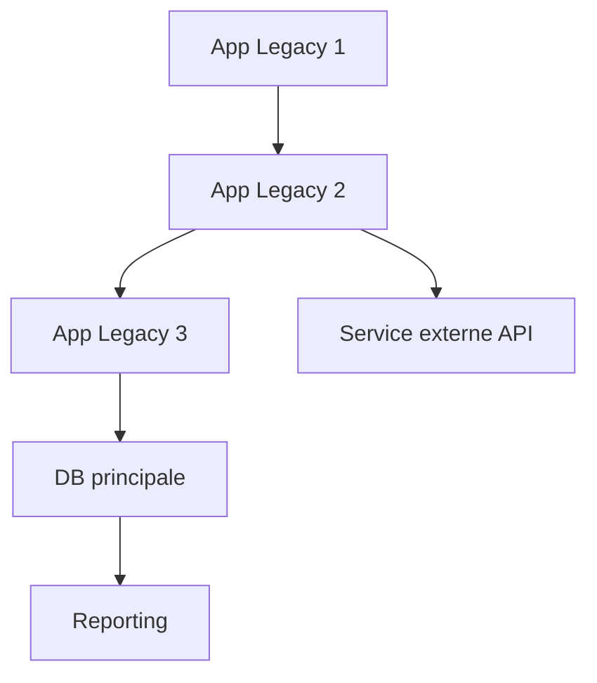
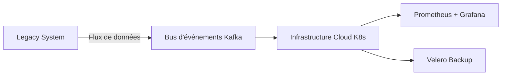
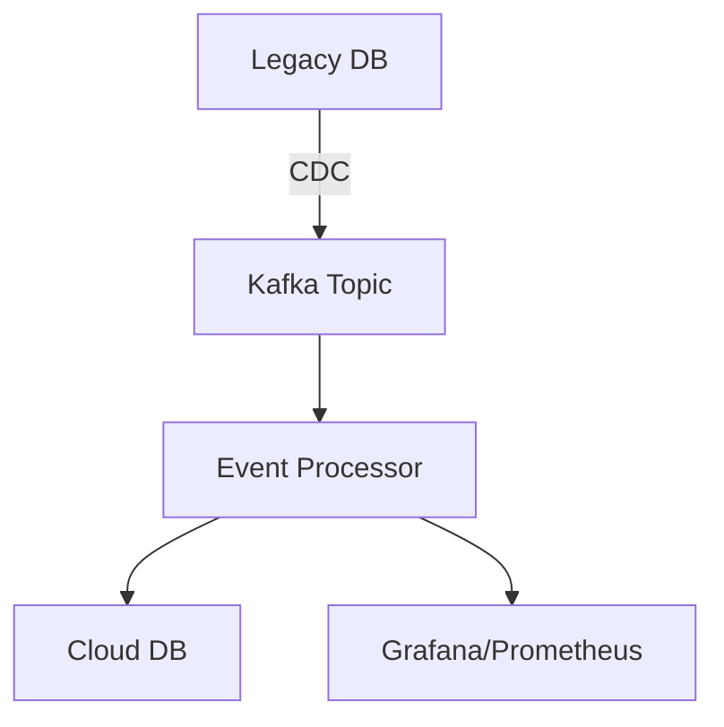
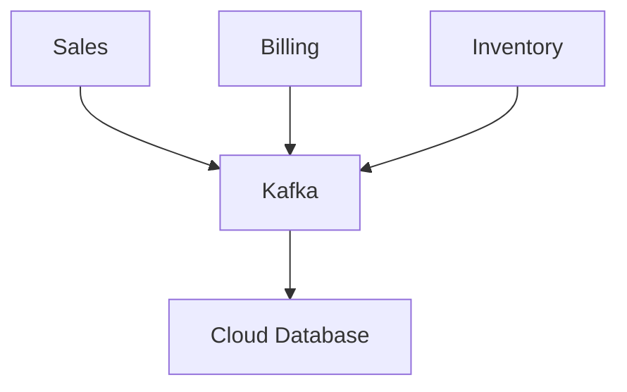
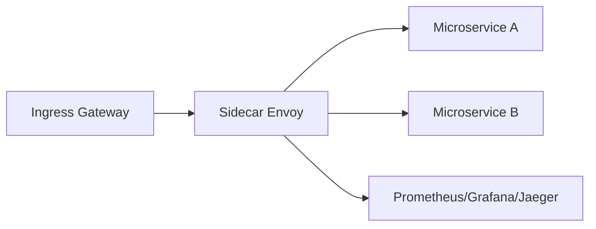
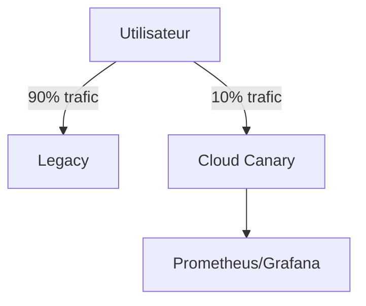
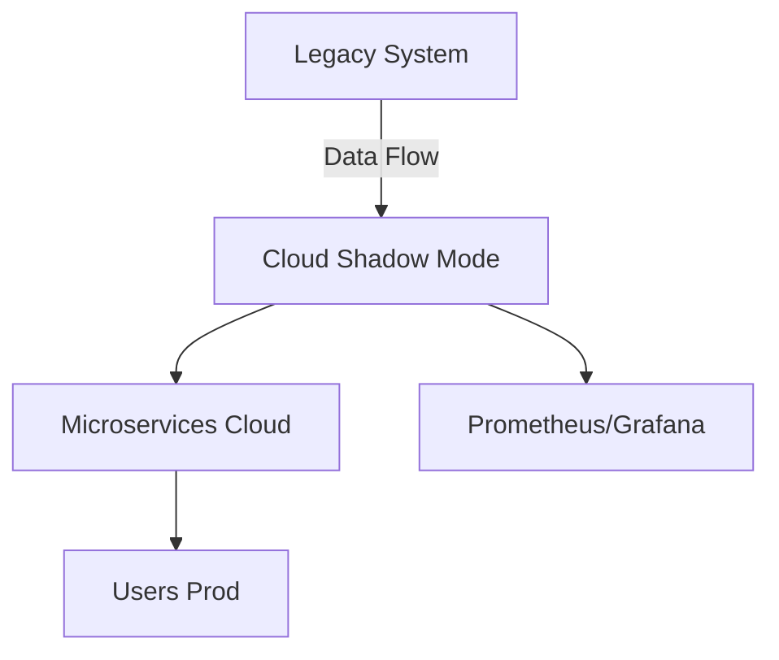

# 🧭 **GUIDE OPÉRATIONNEL : Migration Legacy → Cloud Critique — Zero Downtime**

---

## 🎯 **Objectif Global**

Migrer :

* 📦 15 ans de données critiques
* ⚙️ 47 applications interconnectées
* 📈 3M transactions/jour
* ⏱ Sans downtime
* 💰 Budget : 2,8M€
* 🏚 Infrastructure legacy 2008, sans documentation complète

---

# 🧱 **Étape 1 : Diagnostic stratégique et cartographie initiale**

| Rubrique                             | Contenu                                                                                                                                   |
| ------------------------------------ | ----------------------------------------------------------------------------------------------------------------------------------------- |
| **⚠️ Enjeux / Défis**                | Infrastructure obsolète, dépendances complexes, SPOFs, risque downtime                                                                    |
| **🎯 Objectifs**                     | Comprendre le système, identifier risques, préparer plan de migration fiable                                                              |
| **💡 Opportunités**                  | Découvrir redondances, préparer découpage microservices futur                                                                             |
| **🛠 Stratégies / Bonnes pratiques** | Collecte exhaustive des assets (logs, DB, scripts), cartographie applicative (Miro / ArchiMate), audit sécurité/RGPD, fiches applicatives |
| **📌 REX**                           | Cartographier avant modification → anticipation des risques critiques                                                                     |
| **📊 Métriques / Livrables**         | Liste applications + dépendances, diagrammes Mermaid, rapport audit sécurité                                                              |

**Mermaid - Cartographie des flux applicatifs :**

**🔧 Mode opératoire / Mise en œuvre :**

1. Centraliser tous les assets dans Confluence/Jira
2. Créer fiches applicatives pour chaque app (propriétaire, rôle, dépendances)
3. Identifier SPOFs et risques critiques
4. Générer diagramme Mermaid pour visualisation

**Top Use Cases :**

* 🖥 Identification des applications critiques
* 🔄 Cartographie des flux batch / API
* 🔒 Audit sécurité et conformité RGPD

---

# 🏗️ **Étape 2 : Architecture parallèle (Miroir)**

| Rubrique                             | Contenu                                                                                                                 |
| ------------------------------------ | ----------------------------------------------------------------------------------------------------------------------- |
| **⚠️ Enjeux / Défis**                | Downtime si migration directe, tests impossibles sur legacy actif                                                       |
| **🎯 Objectifs**                     | Isoler legacy, sécuriser tests, garantir rollback                                                                       |
| **💡 Opportunités**                  | Tester cloud réel, préparer CI/CD et monitoring complet                                                                 |
| **🛠 Stratégies / Bonnes pratiques** | Cloud hybride K8s + services managés, Kafka + Debezium, IaC Terraform/Ansible, budget tampon 15%, isolation réseau/logs |
| **📌 REX**                           | Legacy jamais interrompu, coupure cloud → aucun impact                                                                  |
| **📊 Métriques / Livrables**         | Infra miroir opérationnelle, scripts IaC, dashboards monitoring prêts                                                   |

**Mermaid - Architecture miroir :**

**🔧 Mode opératoire / Mise en œuvre :**

1. Provisionner infra cloud via Terraform
2. Déployer services parallèles K8s
3. Configurer Kafka + Debezium pour ingestion data
4. Monitoring et backup via Prometheus + Velero

**Top Use Cases :**

* 🧪 Tests réels isolés sans impacter legacy
* 🔄 Double-run pour validation de la performance
* 🛡 Sécurisation des flux critiques

---

# 🧪 **Étape 3 : Event Sourcing + CDC**

| Rubrique                             | Contenu                                                                                       |
| ------------------------------------ | --------------------------------------------------------------------------------------------- |
| **⚠️ Enjeux / Défis**                | Perte cohérence, rollback lent, complexité transactionnelle                                   |
| **🎯 Objectifs**                     | Garantir intégrité, replay instantané, cohérence en temps réel                                |
| **💡 Opportunités**                  | Base solide pour microservices cloud, audit event-driven                                      |
| **🛠 Stratégies / Bonnes pratiques** | Event sourcing, CDC Debezium, Kafka Topics par flux, OpenTelemetry, tests de replay réguliers |
| **📌 REX**                           | Rollback immédiat, bugs latents détectés, validation SLO business                             |
| **📊 Métriques / Livrables**         | Tableau flux événementiels, latence <100ms, dashboards monitoring, logs centralisés           |

**Mermaid - Architecture événementielle :**

**🔧 Mode opératoire :**

1. Configurer CDC pour chaque DB
2. Définir topics Kafka par domaine
3. Implémenter event processor pour ingestion cloud
4. Mettre en place dashboards, alertes et replay tests

**Top Use Cases :**

* 🔄 Replay transactions critiques
* 🕵️ Détection de bugs latents
* 📈 Validation SLO & KPI business

---

# 🔄 **Étape 4 : Découplage progressif / Microservices DDD**

| Rubrique                             | Contenu                                                                                     |
| ------------------------------------ | ------------------------------------------------------------------------------------------- |
| **⚠️ Enjeux / Défis**                | Dépendances legacy complexes, risque downtime par domaine                                   |
| **🎯 Objectifs**                     | Migrer par domaine, réduire risque, architecture cloud scalable                             |
| **💡 Opportunités**                  | Déploiement indépendant, observabilité complète, CI/CD prêt                                 |
| **🛠 Stratégies / Bonnes pratiques** | Bounded contexts DDD, microservices cloud, event-driven, tests par domaine                  |
| **📌 REX**                           | Migration indépendante par domaine, validation continue, zero downtime                      |
| **📊 Métriques / Livrables**         | Diagrammes microservices, topics events documentés, tests unitaires/integration par domaine |

**Mermaid - Microservices DDD :**

**🔧 Mode opératoire :**

1. Découper legacy par domaine (bounded context)
2. Déployer microservice cloud pour chaque domaine
3. Configurer communication event-driven et monitoring
4. Effectuer tests unitaires + intégration par domaine

**Top Use Cases :**

* 🏷 Facturation indépendante
* 📦 Gestion stock / commandes
* 📊 Reporting par domaine

---

# 🛡️ **Étape 5 : Service Mesh (Istio / Linkerd)**

| Rubrique                             | Contenu                                                                           |
| ------------------------------------ | --------------------------------------------------------------------------------- |
| **⚠️ Enjeux / Défis**                | Sécurité intra-cluster, routage complexe, observabilité limitée                   |
| **🎯 Objectifs**                     | Sécurité (mTLS), observabilité, résilience, contrôle granularité flux             |
| **💡 Opportunités**                  | Zero Trust, traffic shaping, retries, rate limiting                               |
| **🛠 Stratégies / Bonnes pratiques** | Sidecar proxy, VirtualServices Istio, tracing distribué Jaeger, chaos engineering |
| **📌 REX**                           | Proxy mal configuré → tuning latency/retries, RBAC strict → Zero Trust            |
| **📊 Métriques / Livrables**         | Latence réseau, taux succès appels internes, dashboards observabilité, alerting   |

**Mermaid - Service Mesh :**

**🔧 Mode opératoire :**

1. Déployer sidecars sur chaque microservice
2. Configurer mTLS et VirtualServices
3. Intégrer tracing distribué + dashboards
4. Exécuter tests chaos engineering

**Top Use Cases :**

* 🔒 Sécurisation trafic intra-cluster
* 🔀 Routage progressif / canary
* 🕵️‍♂️ Tracing et alerting fin

---

# 🧪 **Étape 6 : Tests réels dès J+1 (Canary Release)**

| Rubrique                             | Contenu                                                                                             |
| ------------------------------------ | --------------------------------------------------------------------------------------------------- |
| **⚠️ Enjeux / Défis**                | Détection tardive bugs, SLA en danger                                                               |
| **🎯 Objectifs**                     | Valider comportement réel dès prod, limiter impact                                                  |
| **💡 Opportunités**                  | Ajuster scaling, latence, feature flags avant migration complète                                    |
| **🛠 Stratégies / Bonnes pratiques** | Canary 10%, dark launch, A/B tests, rollback auto, tests non-régression business                    |
| **📌 REX**                           | 2 incidents critiques détectés, ajustement timeout & circuit breakers                               |
| **📊 Métriques / Livrables**         | Latence <300ms, taux erreur <0,5%, dashboards Prometheus/Grafana, tests automatisés Postman/Cypress |

**Mermaid - Canary Release :**

**🔧 Mode opératoire :**

1. Activer 10% trafic sur Canary
2. Collecter métriques et logs
3. Comparer avec legacy
4. Rollback auto si seuil dépassé

**Top Use Cases :**

* 🧪 Validation features critiques
* ⚡ Performance monitoring réel
* 🔄 Ajustements immédiats

---

# 👥 **Étape 7 : Équipe ultra-réduite & Migration par aspiration**

| Rubrique                             | Contenu                                                                                                                       |
| ------------------------------------ | ----------------------------------------------------------------------------------------------------------------------------- |
| **⚠️ Enjeux / Défis**                | Coordination rapide, pression sur legacy                                                                                      |
| **🎯 Objectifs**                     | Minimiser risques, ownership total, migration progressive                                                                     |
| **💡 Opportunités**                  | Shadow mode → tests réels, metrics par endpoint, bascule progressive                                                          |
| **🛠 Stratégies / Bonnes pratiques** | 3 architectes seniors, Shape-Up, Mob programming, pas de daily, migration par aspiration, metrics endpoint, rollback immédiat |
| **📌 REX**                           | Migration domaine par domaine, zero downtime, validation continue                                                             |
| **📊 Métriques / Livrables**         | Temps réponse <250ms, dispo 99,999%, coût infra divisé par 3, dashboards métriques endpoint                                   |

**Mermaid - Shadow Mode & Aspiration :**

**🔧 Mode opératoire :**

1. Shadow mode actif 2 mois
2. Aspiration progressive par domaine
3. Collecte métriques endpoint
4. Rollback immédiat si anomalies

**Top Use Cases :**

* 📦 Migration progressive par domaine
* 🧪 Tests en production réelle
* 🔁 Validation end-to-end

---

