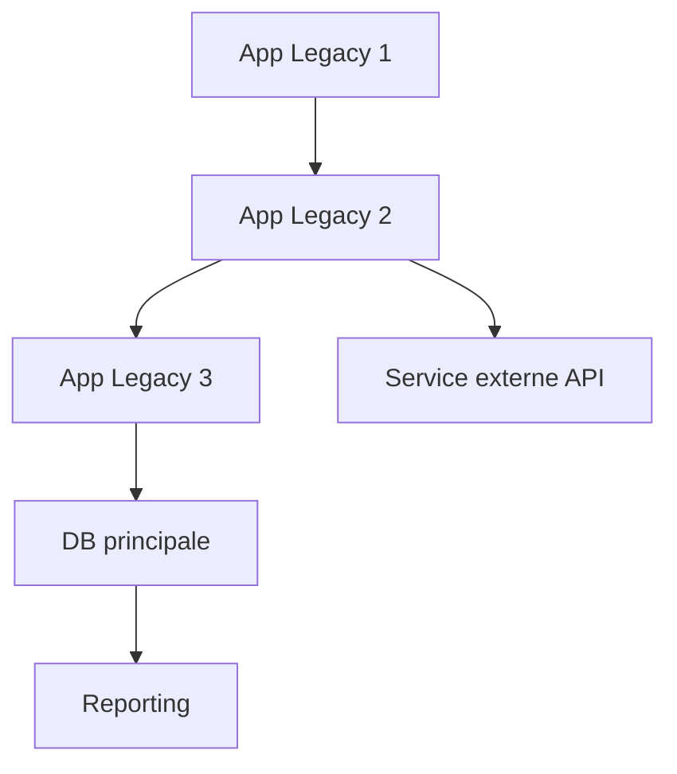
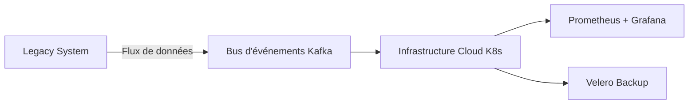
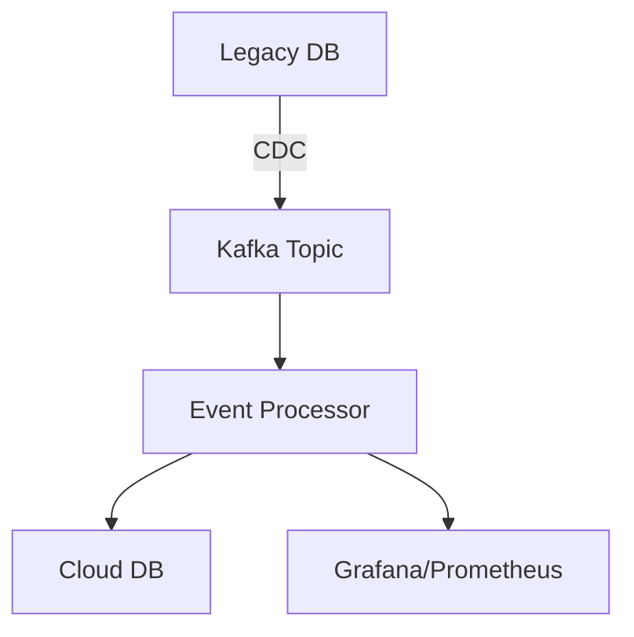
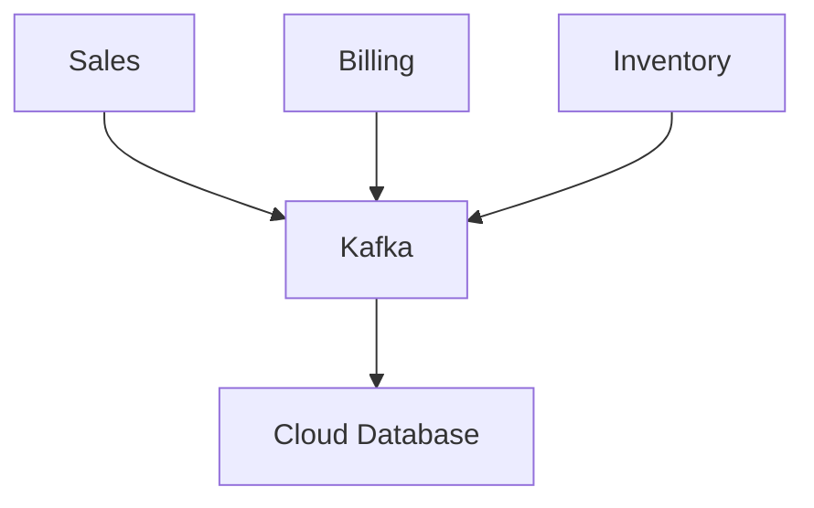
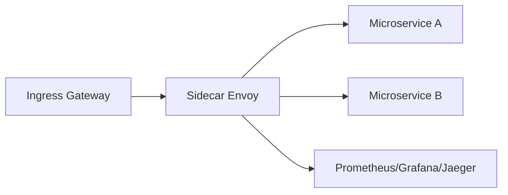
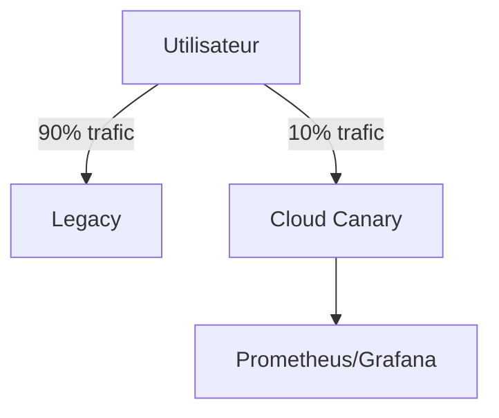
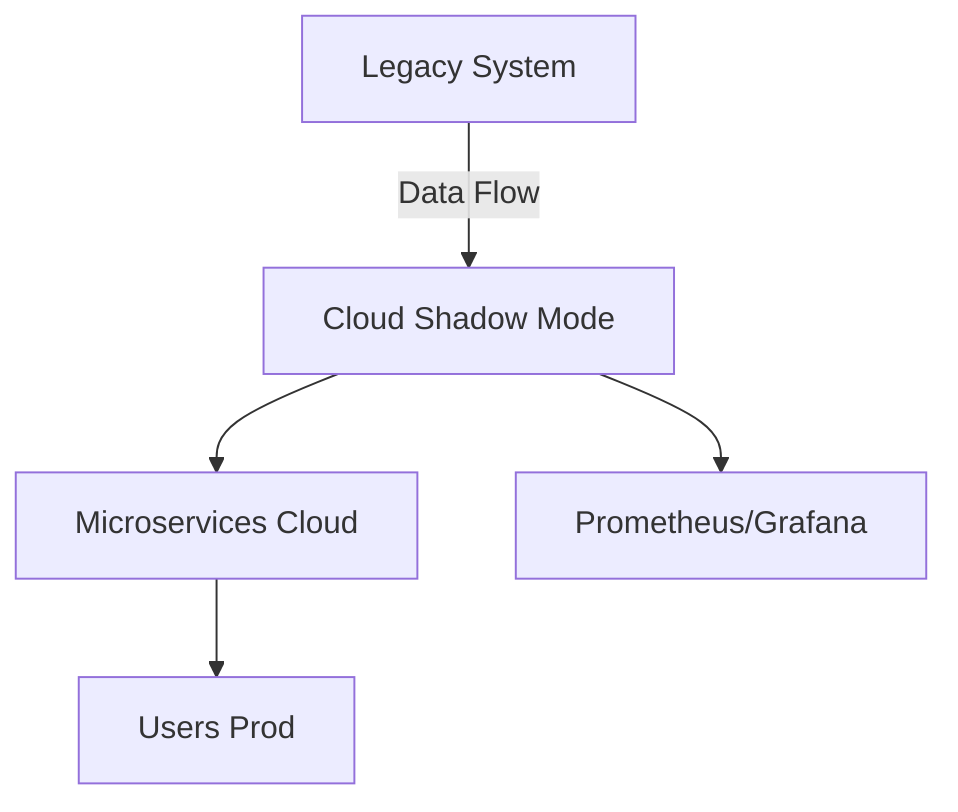

# 🧭 GUIDE OPÉRATIONNEL : Migration d’un Système Legacy Critique vers le Cloud — Zero Downtime

## 🎯 Objectif Global

Migrer :

* 15 ans de données critiques
* 47 applications interconnectées
* 3M de transactions/jour
* Sans aucun downtime
* Budget : 2,8M€
* Infrastructure legacy obsolète (2008), **sans documentation complète**

---

# 🧱 **Étape 1 : Diagnostic stratégique et cartographie initiale**

### Objectif : Comprendre avant d’agir

**Actions :**

* Collecte de tous les assets techniques : code, logs, schémas, DB, scripts
* Cartographie des 47 applications et flux inter-applications
* Identification des zones critiques et SPOFs
* Évaluation des performances : CPU, I/O, réseau

**Outils :** Elastic Stack, Miro / ArchiMate, Jira + Confluence

**Bonnes pratiques :**

* Fiche par application : rôle, dépendances, propriétaire
* Audit sécurité + conformité RGPD

**REX :** Cartographier avant toute modification → gain de visibilité et anticipation des risques.

**Mermaid - cartographie des flux applicatifs :**

---

# 🏗️ **Étape 2 : Architecture parallèle (Miroir)**

### Objectif : Isoler le legacy et sécuriser la migration

**Architecture choisie :**

* Cloud hybride (K8s + services managés : S3, RDS)
* Bus d’événements : Kafka + CDC (Debezium)
* Infrastructure as Code : Terraform + Ansible

**Outils :** Terraform, Istio, Velero

**Bonnes pratiques :**

* Ne jamais modifier le legacy
* Construire CI/CD + monitoring en parallèle
* Prévoir un budget tampon (\~15%)
* Isoler réseau et logs

**REX :** Le legacy n’a jamais été interrompu ; coupure du cloud → aucun impact.

**Mermaid - architecture miroir :**

---

# 🧪 **Étape 3 : Synchronisation via Event Sourcing + CDC**

### Objectif : Assurer cohérence et rollback instantané

**Méthodologie :**

* Chaque modification = événement capturé
* Rejouer events si incident
* Canary updates possibles

**Outils :** Kafka, Debezium, PostgreSQL WAL, OpenTelemetry

**Mermaid - architecture événementielle :**

**Tableau Flux & Cohérence :**

| Event       | Source     | Target        | Métrique        | Latence |
| ----------- | ---------- | ------------- | --------------- | ------- |
| Transaction | Legacy DB  | Cloud DB      | Success / Fail  | <100ms  |
| Update User | Legacy API | Microservice  | Replayed Events | <50ms   |
| Log         | Legacy App | Observability | Traces          | <5ms    |

**REX :**

1. Rollback immédiat possible sur incidents
2. Replay tests avant bascule → 0 perte de données
3. Détection de bugs latent legacy
4. Réduction du stress opérationnel
5. Validation des SLO côté business

---

# 🔄 **Étape 4 : Découplage progressif / Architecture microservices DDD**

**Objectif :** Migrer par domaine pour réduire complexité

**Méthodologie :**

* Découper legacy par **bounded context** (Domain Driven Design)
* Microservices cloud pour chaque domaine
* Event-driven communication

**Mermaid - Architecture microservices DDD :**

**REX :**

* Chaque domaine migré indépendamment
* Zero downtime + validation continue

---

# 🛡️ **Étape 5 : Service Mesh (Istio/Linkerd)**

**Objectifs :** Sécurité, routage, observabilité, résilience

**Architecture :**

**Bonnes pratiques :**

* mTLS activé par namespace
* VirtualServices limités
* Tracing dès le début
* Chaos testing intégré

**REX :**

* Proxy mal configuré → latence (solution : tuning retries/timeouts)
* RBAC strict → Zero Trust

---

# 🧪 **Étape 6 : Tests réels dès J+1 (Canary Release)**

**Objectifs :** Détecter bugs réels tôt, mesurer latence et erreurs

**Mermaid - Canary Release :**

**Bonnes pratiques :**

* Rollback automatique si erreurs > seuil
* Intégrer tests non-régression business
* Mesurer taux d’erreur, latence, throughput

**REX :** 2 incidents critiques détectés dès J+1, latence critique identifiée

---

# 👥 **Étape 7 : Équipe ultra-réduite et migration par aspiration**

**Organisation :** 3 architectes seniors, PO/tech leader = même personne, pas de daily

**Migration par aspiration :**

* Nouveau système **aspire uniquement les données nécessaires**
* Shadow mode → 2 mois
* Bascule progressive par domaine

**Mermaid - Shadow Mode et Aspiration :**

**Bonnes pratiques :**

* Pas de big bang
* Metrics sur chaque endpoint
* Rollback immédiat si anomalie

**Résultats à 6 mois :**

| Indicateur       | Avant   | Après                                            |
| ---------------- | ------- | ------------------------------------------------ |
| Temps de réponse | 2,1 s   | 250 ms                                           |
| Disponibilité    | 99,1%   | 99,999%                                          |
| Coût infra       | 78 000€ | 24 000€                                          |
| Volume traité    | 1,2 To  | 9,6 To                                           |
| Feedback DG      | -       | "Vous avez sauvé notre transformation digitale." |

---

# 🧠 **Leçons clés**

| Thème        | Bonne pratique                                                |
| ------------ | ------------------------------------------------------------- |
| Sécurité     | Architecture événementielle + Service Mesh → rollback garanti |
| Organisation | Petite équipe senior → 10x plus rapide                        |
| Architecture | Séparer legacy / cloud dès le début                           |
| Testing      | Tests réels > mocks                                           |
| Migration    | Aspirer les données = moins de stress, fiabilité maximale     |

---

